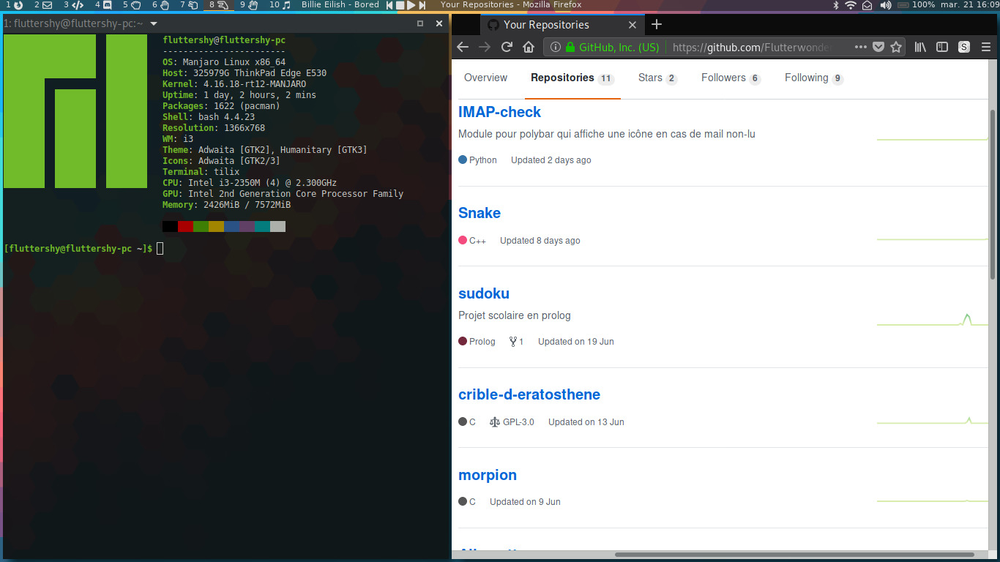

# dotfiles

Repository qui regroupe mes dotfiles afin que je puisse récupérer mon environnement en quelques commandes depuis n'importe quelle machine.

## Aperçu


## Installation
### Base
```bash
git clone https://github.com/Flutterwondershy/dotfiles.git
cd dotfiles
make #packages, i3(+vim+polybar), mpd (par défaut les 3)
chmod +x ~/.config/polybar/module-{arch_update,bluetooth,calendar,openweathermap-simple}/script.sh ~/.config/i3/autorun.py
```

### Module de mails pour polybar
Voir [ce repository](https://github.com/Flutterwondershy/IMAP-check)

## Utilisation
### Lancement automatique
Lorsqu'un espace de travail spécifique à une tâche est ouverte, un script cherche à lancer le programme correspondant si celui-ci n'est pas déjà lancé.
Par défaut, les espaces de travail sont les suivants: 

| Numéro | Utilité | Programme lancé par défaut |
|:-------|:-------:|---------------------------:|
| 1 | Navigateur | Firefox |
| 2 | Mails | Thunderbird |
| 3 | Code |  |
| 4 | Discord | Discord |
| 5 | Pierre |  |
| 6 | Feuille |  |
| 7 | Ciseaux |  |
| 8 | Lézard |  |
| 9 | Spock |  |
| 10 | Musique | Cantata |
### Clavier

| Touches | Action |
|:--------|-------:|
|`$mod+o` | réduit l'espace entre les fenêtres |
|`$mod+p` | augmente l'espace entre les fenêtres |
|`$mod+vol+` | augmente le volume de l'ordinateur |
|`vol+` | augmente le volume du serveur mpd |
|`$mod+vol-`| baisse le volume de l'ordinateur |
|`vol-` | baisse le volume du serveur mpd |

Les touches multimédia (play/pause, suivant et précédent) permettent de manipuler le serveur mpd.

## TODO
- [ ] Démarche pour vim
- [ ] Décrire la configuration UI
- [ ] Ajouter qutebrowser
- [ ] Raccourci netflix
